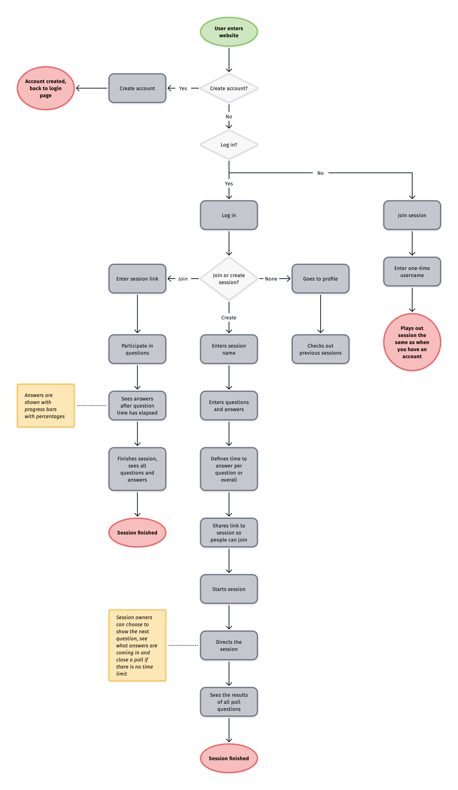
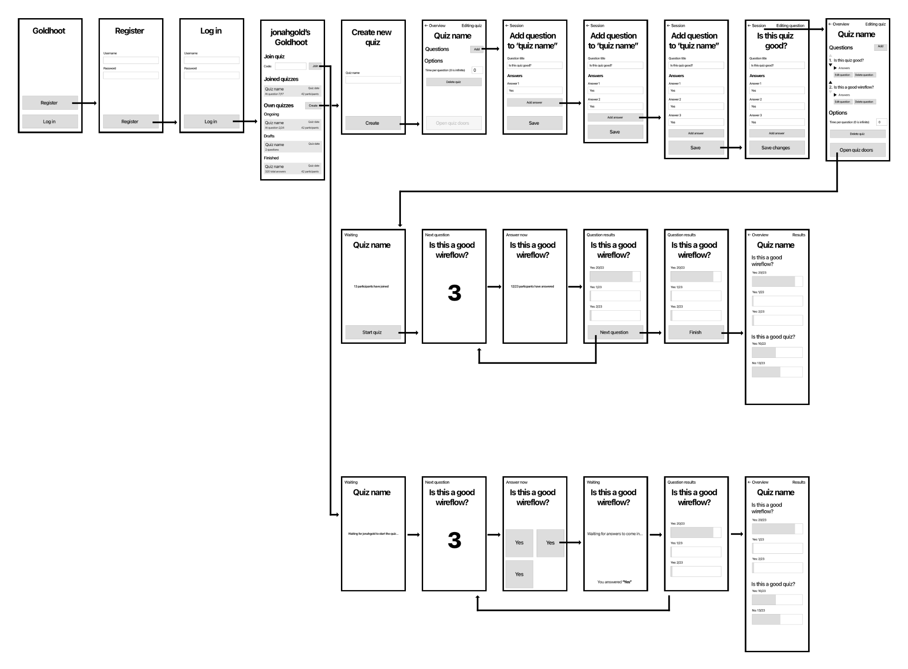

# Goldhoot

[Link to website](https://browser-tech-goldhoot.herokuapp.com/)

Goldhoot is a quiz platform to the likes of [Kahoot](https://kahoot.com). Create quizzes, invite people, have fun!

## Index

- [Features](#features)
- [Enhancements](#enhancements)
- [Flowchart](#flowchart)
- [Wireflow](#wireflow)
- [Chosen browsers](#chosen-browsers)

## Features

- [x] Create quiz
	- [x] Publish quiz
	- [x] Share quiz with link
	- [x] Start a quiz
	- [x] Proceed to next question
	- [x] See results of all questions in quiz
- [x] Create question
	- [x] Change question title
	- [x] Delete question
	- [x] Change question position in quiz
- [x] Create answer
	- [x] Edit answer
	- [x] Delete answer
- [x] Profile page (became homepage)
- [x] Join quiz
	- [x] Answer questions
	- [x] See results
	- [x] Get shown new question

## Enhancements

- [x] Have the quiz host and join flow completely work through web sockets so it's copmletely real time.
- [x] Add new answers to a question inline instead of refreshing the page when submitting using `<template>` tags.
- [x] Add confirmation dialog when deleting anything.

## Flowchart

## Wireflow

[PDF version](docs/wireflow.pdf)

## Chosen browsers

- Safari 14 on macOS Big Sur 11.2.3
- Chrome 89 on macOS Big Sur 11.2.3
- Safari 14 on iPhone with iOS 14.4.1
- Firefox 80.1.1 on Google Pixel 5 with Android 11

<!-- Add a nice poster image here at the end of the week, showing off your shiny frontend 📸 -->

<!-- How about a section that describes how to install this project? 🤓 -->

<!-- ...but how does one use this project? What are its features 🤔 -->

<!-- Maybe a checklist of done stuff and stuff still on your wishlist? ✅ -->

<!-- How about a license here? 📜 (or is it a licence?) 🤷 -->
