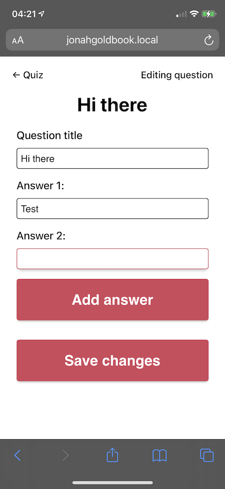
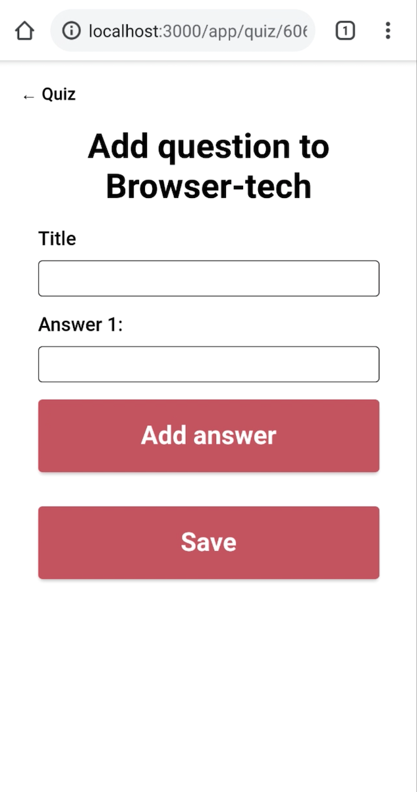
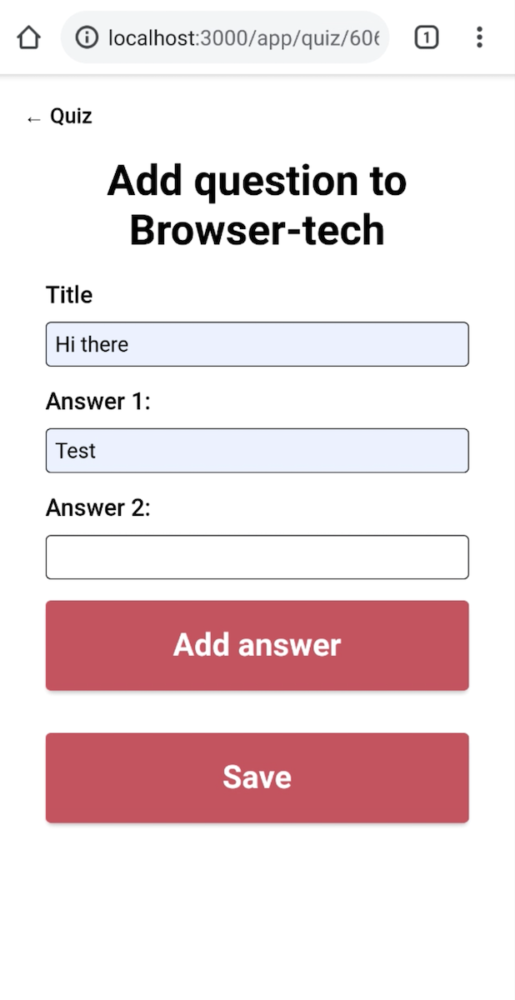
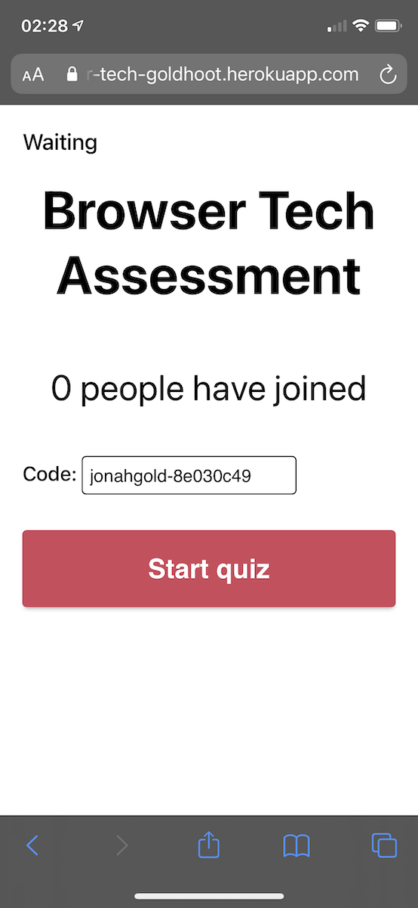
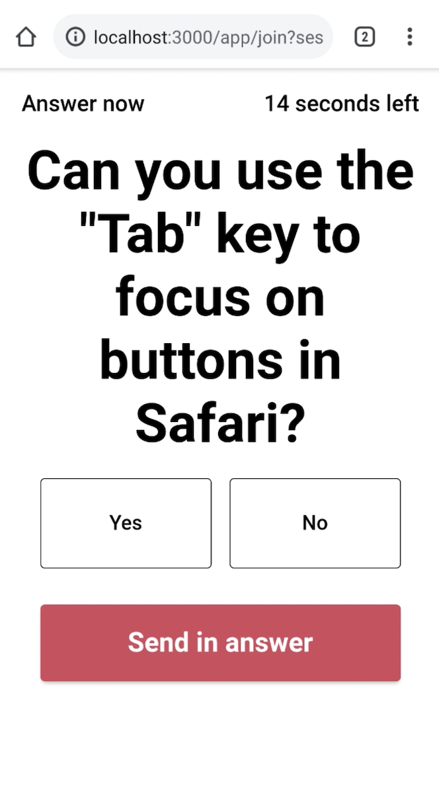

# Goldhoot

 

[Link to website](https://browser-tech-goldhoot.herokuapp.com/)

Goldhoot is an app where you can create poll quizes. People can join based on quiz codes and answer the question in the order you want to present them.

# Index

- [Features](#features)
- [Enhancements](#enhancements)
- [Wireflow](#wireflow)
- [Testing features](#testing-features)

# Features

- [x] Create quiz
	- [x] Publish quiz
	- [x] Share quiz with link
	- [x] Start a quiz
	- [x] Proceed to next question
	- [x] See results of all questions in quiz
- [x] Create question
	- [x] Change question title
	- [x] Delete question
	- [x] Change question position in quiz
- [x] Create answer
	- [x] Edit answer
	- [x] Delete answer
- [x] Profile page (became homepage)
- [x] Join quiz
	- [x] Answer questions
	- [x] See results for current question
	- [x] Continue to the next question

## Wishlist

- Cancelling the publication of a poll quiz.

# The three layers of progressive enhancement

1. All basic content is displayed in semantic HTML. The quiz flow is kept up-to-date with frequent page refreshes, which might be a bit jarring, but all moments where user input is required are not automatically refreshed to make the experience more bearable.
2. With CSS I bring more hierarchy to the content. The content is usable by itself, but the CSS just gives the content the extra push it needs to be fully usable.
3. With JS I take interactivity to a whole new level. Using Web Sockets and template tags I have made sure to streamline the quiz flow, creating and editing questions, and more!

A list of all the enhancements I've put in place are found below.

## List of all enhancements

- CSS Grid layouts, built upon working flexbox layouts.
- A proper countdown with CSS animations, instead of the numbers "3", "2" and "1" statically displayed on the screen.
- Deletion confirmations with `confirm()`.
- "Add answer" creating a new answer input instead of submitting the form and thus refreshing the page.
- Web Sockets when hosting or joining a quiz, streamlining the experience and making it snappier for all parties.

# Wireflow

[PDF version](docs/wireflow.pdf)

# Testing features

This part of the README covers the testing I've done with my app to ensure all features are progressively enhanced. I have isolated 3 features that I'll be testing in 4 different scenarios, using the browsers that I've listed further down below. I'll be noting the changes each scenario makes from the baseline I'm setting with everything enabled.

## The features

1. Adding questions and answers to a quiz.  
	This feature has a lot of added enhancements with JavaScript, making it interesting to see what the baseline is and where these enhancements have been put into place.

2. Hosting a quiz.  
	This feature was very difficult to create without Web Sockets, so I'd like to see how it performs without it.

3. Participating in (joining) a quiz.  
	The same is applied here, but with added difficulties due to the asynchronity of having to use page refreshes while you aren't in control of the current state of the quiz (is a question counting down, has everybody already answered, has the timer run out before you pressed send?). 

## Test scnearios

1. Everything is enabled.
2. JavaScript and CSS are disabled.
3. JavaScript and cookies are disabled.

## Chosen browsers

- Safari 14 on macOS Big Sur 11.2.3
- Chrome 89 on macOS Big Sur 11.2.3
- Safari 14 on iPhone with iOS 14.4.1
- Chrome 88.0.4324.93 on Google Pixel 5 with Android 11

## Key takeaways

If you don't want to read all my observations below, here are some key takeaways from the testing.

- Headings should be scaled down on mobile to prevent overlapping elements due to text amount.
- The core functionality works, no matter what you try to disable.
- More focus on proper mobile-first design would've prevented small mistakes like font-sizing and spacing between elements on smaller screens.
- Adding `tabindex="0"` to buttons would've added a lot of accessibility improvements to Safari.

## Adding questions and answers to a quiz

### Desktop Safari

#### Everything enabled

- Everything is easily accessible, highlighted and snappy.
- Pressing Enter adds a new answer input when all of them have a value, Shift+Enter saves the changes and returns you to the quiz page.
- Tabbing to buttons and anchor tags is not possible unless I set `tabindex` to 0 on them, which I haven't.

#### JavaScript and CSS Disabled

- Content hierarchy is still logical, but the heading with the question title misses a little context.
- Fieldset takes up full width of screen, which is distracting.
- Buttons are barely visible due to their small font sizes (11px) and their white on white background colours.
- Add answer now saves the changes and then immediately redirects you back to the editing page, which is a nice starting point but not as nice as having it happen without a page refresh (although the JS action doesn't save the changes made with each added answer).
- Newly added input is still focussed, which is nice.

#### JavaScript and cookies are disabled

- Pretty much works the same as previous session.
- When you remove the `sessid` from the url, your session is lost and you are redirected back to the login screen.

### Desktop Chrome

#### Everything enabled

- Functionality works the same as in Safari, apart from the points mentioned here.
- Buttons and anchor tags are tab-able by default, which delivers a way better experience then in Safari.
- Shift+Enter opens the page in a new window, which is a weird quirk that I hadn't noticed before.

#### JavaScript and CSS disabled

- Chrome's buttons have a better default styling, which makes them more visible against a white background.
- Fieldset is again very wide, which disrupts the content flow.
- Keyboard behaviour is now the same as with Desktop Safari and JS and CSS disabled, but with better tab-ability.

#### JavaScript and cookies disabled

- Nothing changes, as I use UUID sessions for fallbacks and they are sent to the server as part of the form data.
- The behaviour is the same as with JS and CSS disabled, but then with more clean, clear and distinct styling.

### Mobile Safari

#### Everything enabled

- Pages scale down nicely
- Keyboard interactivity works very well, even focussing onto the right input without any issue.
- Inputs are big and very tap-able.

#### JavaScript and CSS disabled

- The page zooms in when you tap on an input, so if you want to move on to a different input you have to search around the page to find it.
- Adding an input is annoying, because the input is highlighted but not keyboard-focussed, so you cannot start typing right away once the page is reloaded.
- When you add a lot of answers, you need to scroll down to get to the empty input field as just simply pressing Enter will just trigger the "Add answer" functionality server-side.
- The inputs are small when zoomed out, but tap-able because iOS has made it easy to tap smaller elements on a page by predicting what you want to tap.

#### JavaScript and cookies disabled

- You still need to tap on an input before you can actually start typing, but the page doesn't zoom in and out anymore so that makes it a lot less jarrging.
- The inputs are bigger, which means you need to start scrolling to the bottom of the page with less answers than if you disable CSS.
- Apart from that the experience is the same as without JS and CSS but with styling enabled.

### Mobile Chrome

#### Everything enabled

- Usability is almost the same to that in mobile Safari.
- Android has a system that makes the enter key function like a tab key to continue to the next input. This key doesn't work with the `keypress` event, which disables the entire JavaScript functionality of adding a new input by pressing enter.
- The little arrow inside the back button looks like it's from a different font-family altogether.

#### JavaScript and CSS disabled

- The page doesn't zoom in on inputs when selected, which means that the page is properly scaled.
- The keyboard also doesn't pop up immediately after the page has been refreshed, defeating the purpose of `autofocus` entirely.
- There is no margin on any of the inputs or buttons, making the interface very cramped.

#### JavaScript and cookies disabled

- The experience is not hindered by having cookies disabled
- Page reload issues with `autofocus` still remain.
- Having CSS enabled improves clarity immensely by adding more margin between page elements and compressing space taken up by others (like the heading).

## Hosting a quiz

### Desktop Safari

#### Everything enabled

- WebSockets make the experience incredibly snappy.
- Buttons are large and easily show what they do.
- Keyboard accessibility is sadly impossible here, due to Safari not supporting tabbing onto buttons by default.
- Meters are very nicely styled, and clearly show which answer was the most popular one (and it's also literally told).
- Some text is quite small for desktop, especially when you look at the page where it shows how much time is left for a question, and how many people have already answered.

#### JavaScript and CSS disabled

- Page refreshes make the app responsive, but you can clearly notice a loss in instantaneity.
- The timer no longer ticks down, but it does say that it's the total time everyone has instead of the amount of time _left_.
- The `<meter>` has clear default styling, although their background has a low contrast against a white background.

#### JavaScript and cookies disabled

- Nothing really changes from having JS disabled, but it does have the nice styling.
- All logic still works, as disabled cookies don't disable the UUID session I have in place as a backup.

### Desktop Chrome

#### Everything enabled

- The `<meter>` has a small blue border that doesn't appear in Safari.
- Buttons are focussable, meaning you can complete the entire flow with only a keyboard.

#### JavaScript and CSS disabled

- The flow behaves the same, but the page refreshes take some of the instantaneity out.
- The countdown page refresh is perfectly timed, showing the next page after the countdown is done.

#### JavaScript and cookies disabled

- CSS makes the page look nicer, but without JS it is not the same as when you have WebSockets.
- UUID session saves the day here as well, making sure that everything works without cookies.

### Mobile Safari

#### Everything enabled

- The experience is smooth due to WebSockets.
- Larger questions and answers break the layout, since this is not taken into account with the applied styling.

#### JavaScript and CSS disabled

- Styling doesn't overlap anymore.
- Page refreshes are jarring on mobile in places where it can hinder the experience, like when you want to copy the quiz code.
- The countdown animation doesn't work anymore, which definitely added more flair on mobile than it did on desktop in terms of experience. Apart from this everything works fine still.

#### JavaScript and cookies disabled

- This scneario only hampers the experience in terms of responsiveness, as hosting a quiz only requires JS for WebSockets.
- Session still works, so you're not logged out. Even if you disable cookies and remove it in the meantime (but don't you dare touch that `sessid` in the URL bar).

### Mobile Chrome

#### Everything enabled

- Font sizing is a little big.
- `<meter>` border from Chrome Desktop is gone.
- Touch points are nice and big, making them accessible.

#### JavaScript and CSS disabled

- Base styling of Chrome looks quite good on mobile.
- Page refreshes are a little more jarring, just like on Mobile Safari.

#### JavaScript and cookies disabled

- A good middle ground, but the page refreshes are still annoying when trying to copy the quiz code.

## Joining a quiz

### Desktop Safari

#### Everything enabled

- WebSockets make the flow very fast
- Inputs are focussable with keyboard.
- The timer clearly shows how much time is left before you cannot answer anymore.

#### JavaScript and CSS disabled

- Page refreshes make it awkward when answering a question, because you don't know if the time limit has already been reached due to desynchronisation.

#### JavaScript and cookies disabled

- The styling adds a lot to the experience, but with JS disabled it all still feels a bit slow.
- Everything still works, because UUID sessions work when cookies sessions don't.

### Desktop Chrome

#### Everything enabled

- WebSockets make the experience snappy
- The styling is consistent, but `<meter>` has the same border issue as when hosting a quiz.

#### JavaScript and CSS disabled

- The layout is shifted a lot, but the content is still very clear.
- The instantaneity is gone becasue of the lack of WebSockets, but periodic page refreshes partially make up for that.
- The countdown gets out of sync if the host clicks "Next question" just out of time, leaving less time to answer the actual question.
- You sometimes get the results before the host does.

#### JavaScript and cookies disabled

- The styling adds a lot to the experience, but with JS disabled it all still feels a bit slow.
- When cookies are disabled, UUID session takes over so no functionality is lost.

### Mobile Safari

#### Everything enabled

- Playing the quiz is a breeze with WebSockets enabled, especially on mobile!
- Questions with long titles can push the "Send in answer" button to below the bottom of the viewport, which feels a bit wrong.

#### JavaScript and CSS disabled

- The native button styling has a lot more contrast than the desktop version.
- Button text is still quite small when trying to submit the chosen answer.
- `<meter>` elements give me nostalgia to OSX Snow Leopard days.

#### JavaScript and cookies disabled

- The overlapped styling is back.
- Page refreshes as well.

### Mobile Chrome

#### Everything enabled

- Overlapping text is less of a problem due to the larger DPI of the Pixel 5.
- The experience is identital to the one in Safari apart from this.

#### JavaScript and CSS disabled

- Chrome probably really liked Safari's `<meter>` styling, and decided to copy it (or the other way around of course).

#### JavaScript and cookies disabled

- The exact same as the Everything enabled scenario, but with page refreshes instead of WebSockets.
